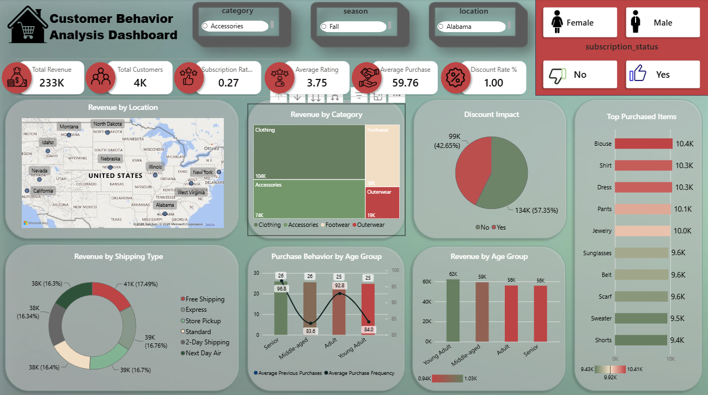

# Customer-Behavior-Analytics-Dashboard
This project represents a complete, industry standard, end-to-end data analytics workflow, designed to mirror the real responsibilities of professional analysts in modern business environments. The project encompasses all critical stages of data analysis, from data preparation and modeling to insight generation, visualization, and reporting.

## 📷 Dashboard Preview

  

## 📖 Project Overview
This project analyzes customer shopping behavior using transactional retail data to uncover purchasing patterns, customer demographics, product preferences, and subscription trends. The interactive Power BI dashboard provides actionable business insights that support data-driven marketing, customer segmentation, and strategic decision-making.

## 🎯 Business Problem

Retail businesses generate large amounts of customer transaction data, making it challenging to identify purchasing patterns, customer segments, and product preferences. This dashboard helps transform raw data into actionable insights, enabling data-driven decisions to improve customer engagement and overall business performance.

## 🎯 Business Objectives

- Analyze customer behavior
- Identify purchasing patterns
- Evaluate subscription adoption
- Compare product performance
- Support business decisions

## 📂 Dataset Overview

| Attribute | Details |
|-----------|---------|
| **Domain** | Retail Analytics |
| **Dataset** | Customer Shopping Behavior Dataset |
| **Rows** | 3,900 |
| **Columns** | 18 |
| **Data Format** | CSV |
| **Missing Values** | 37 missing values in the `Review Rating` column |

## 🛠️ Tools & Technologies

  
  
  
  
  
  

