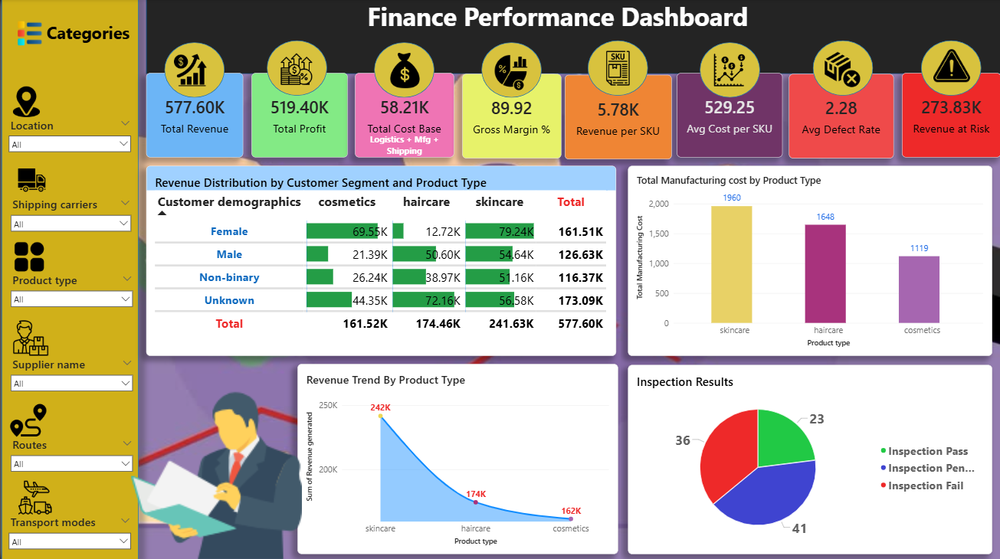
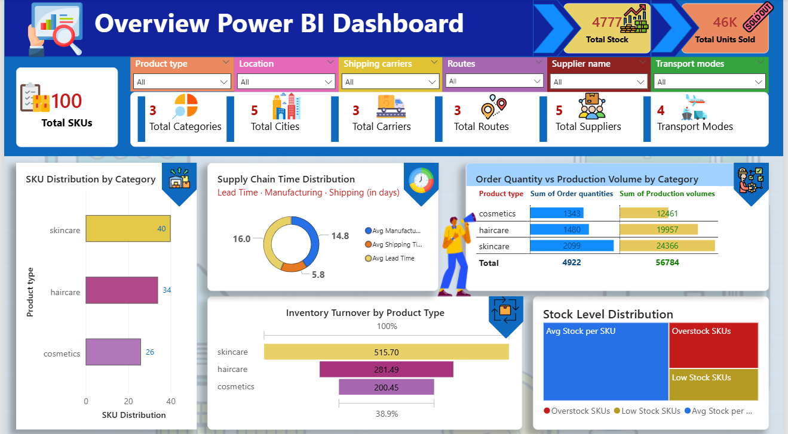

# Smytten Supply Chain Analysis

An end-to-end supply chain analysis for Smytten — a D2C beauty & personal care platform — covering product performance, supplier evaluation, logistics efficiency, and defect tracking across 100 SKUs.

---

## Tools Used

  

---

## Dataset Overview

### `supply_chain_data.csv`
100 SKUs across 3 product categories with the following fields:

| Column | Description |
|---|---|
| Product type | Category — skincare, haircare, cosmetics |
| SKU | Unique product identifier |
| Price | Selling price (INR) |
| Availability | Stock availability (%) |
| Number of products sold | Units sold |
| Revenue generated | Total revenue (INR) |
| Customer demographics | Target segment — Female, Male, Non-binary, Unknown |
| Stock levels | Current inventory count |
| Lead times | Supplier lead time (days) |
| Order quantities | Units ordered |
| Shipping times | Days to ship |
| Shipping carriers | Carrier A / B / C |
| Shipping costs | Cost per shipment (INR) |
| Supplier name | Supplier 1–5 |
| Location | Mumbai, Delhi, Bangalore, Chennai, Kolkata |
| Production volumes | Units produced |
| Manufacturing lead time | Days to manufacture |
| Manufacturing costs | Cost per unit (INR) |
| Inspection results | Pass / Fail / Pending |
| Defect rates | Defect percentage |
| Transportation modes | Road, Air, Rail, Sea |
| Routes | Route A / B / C |
| Costs | Total logistics cost (INR) |

---

## Key Analysis Areas

- **Product Performance** — Revenue and sales volume by category (skincare, haircare, cosmetics)
- **Supplier Evaluation** — Lead time, defect rate, and cost comparison across 5 suppliers and 3 benchmark suppliers
- **Inventory Management** — Stock levels vs. order quantities, identifying overstock and stockout risks
- **Logistics & Shipping** — Carrier performance, transportation mode costs, and route efficiency
- **Quality Control** — Inspection pass/fail rates and defect rate distribution by supplier and product type
- **Geographic Distribution** — Supplier and warehouse locations across 5 Indian cities

---

## Dashboard Highlights

The Power BI dashboard (`supply chain dasgboards.pbix`) covers:
- Revenue breakdown by product category and SKU
- Supplier performance scorecard
- Defect rate trends and inspection status
- Shipping cost analysis by carrier and route
- Lead time vs. manufacturing time comparison

---

